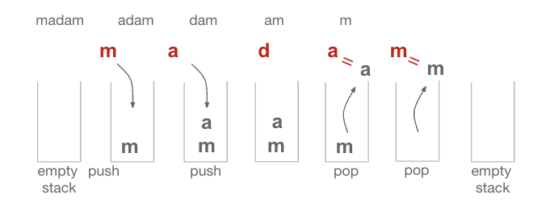
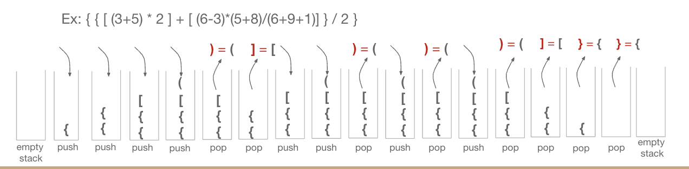

# HW5 - Matching/Analyzing HTML Tags.
- Check whether a given (simplified) HTML web page is valid.
- Input: HTML URL
- Output:
    - Correct: True
    - Incorrect: Print a “False” and then print your stack in one line. Top element should be the first doesn’t match one.
- Assume all matched tags are in the form: `<name> ... </name>`

## HTML Tag Syntax
- `<div> ... </div>` → open and close tags, no space inside <>.
- `<style type="text/css">` → attributes allowed.
- `<meta ... />` → self-closing tag, skipped.
- `<!doctype ...>` → usually declaration or comment, skipped.

## Input/ Output Example
```bash
http://www.example.com
True
```

```bash
http://soslab.nccu.edu.tw/Welcome.html
False ?xml !DOCTYPE html head link !--[if link ![endif]-- !--[if link ![endif]-- style !--
        @import
```

## Upload your code using Moodle
- **First Submission**: 10/05(Sun.) 11:59
- **Deadline**: 10/13(Mon.) 23:59


## Supplementary Knowledge
### Stack Feature
- LIFO (Last In First Out)
- POP: remove the top element
- PEEK: get the top element (without removing it)
- PUSH: add a new element to the top

### Scenarios
1. Function Call
- When a recursive function is invoked, its parameters are stored in a data structure called activation records.
- These activation records are stored in a special stack called the recursive stack.
- Once the function execution is completed, the activation records are deleted.

2. Palindrome
- Push the first half of the text into the stack.
- For the second half, pop elements one by one and check if they match.
- If all characters match and the stack is empty → it is a Palindrome.
- Example: Word "madam"
    - Push `ma` → Stack = [a, m]
    - Ignore middle `d`
    - Compare `am` with popped stack values → matches → palindrome confirmed.
 

3. Valid Parentheses
- Verify that parentheses in the string are paired correctly.
- Valid: `( [ ] )`, `{ ( ) }`, `[ ]`
- Invalid: `( ]`, `( [ ) ]`
- Rules:
    - Each left parenthesis must have a matching right parenthesis.
    - The order is reversed (Last left matches First right).
    - Implemented using the stack’s FILO property.
- Process:
    - If a left parenthesis appears → push into stack.
    - If a right parenthesis appears → pop from stack and compare.
    - At the end, if the stack is empty → valid. Otherwise → invalid.
 