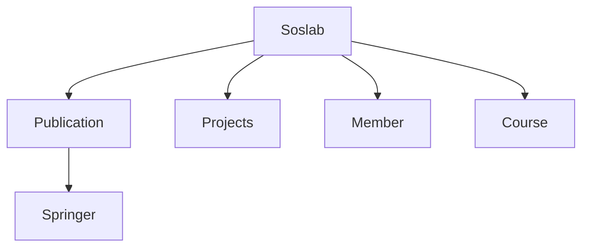
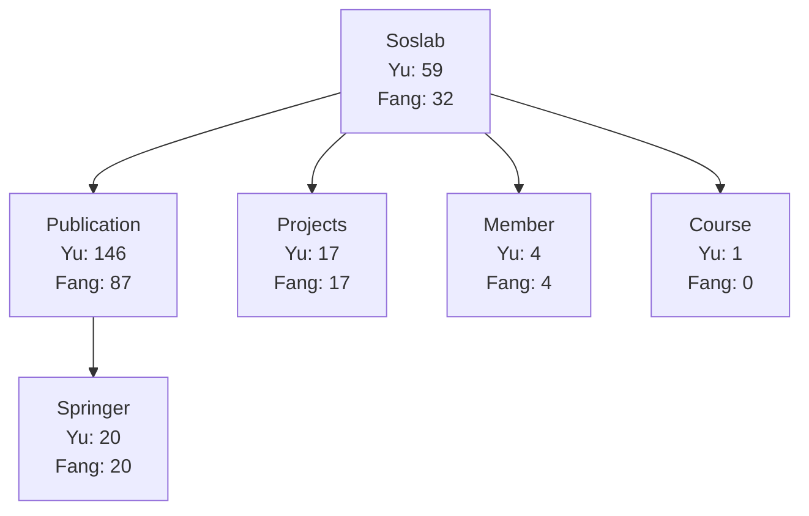
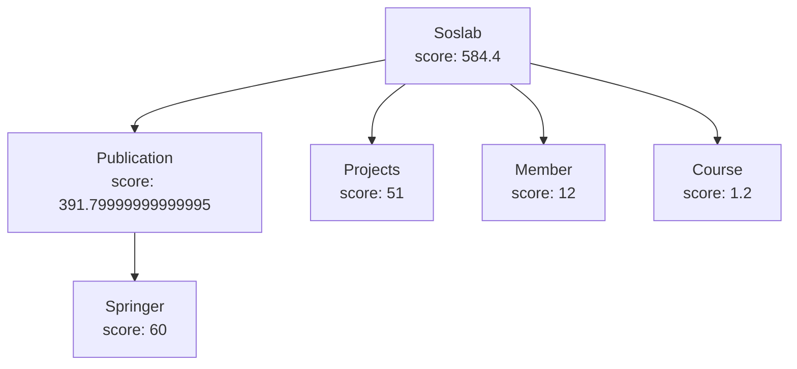

# HW6 - Compute the score of a website!
- Input
    - A set of keywords, the size of this set is N
    - N [keyword.name1 keyword.weight1] [name2 weight2] […] [nameN weightN] 
    - e.g. 2 Yu 1.2 Fang 1.8
- Output: The hole WebTree structure

## Class for HW6
1. Main
2. Keyword : Store keywords
3. WordCounter : Count keyword occurrences
4. WebPage : Calculate webpage score
5. WebNode : Define the relationship between the parent and child nodes and store the accumulation score calculated by the WebPage
6. WebTree : Define tree

### 1. Main
- Main Webpage
    Webpage (“URL”, ”Given website name”)
    ```python
    WebPage rootPage = new WebPage("http://soslab.nccu.edu.tw/Welcome.html", "Soslab");
    ```
- Sub Webpage (Attached to the main webpage)
    `tree.root.addChild` : Root node add child node
    `tree.root.children.get(1).addChild` : Take child node whose index is 1 and add child node
    ```python
    tree.root.addChild(new WebNode(new WebPage("http://soslab.nccu.edu.tw/Publications.html","Publication")));
    tree.root.addChild(new WebNode(new WebPage("http://soslab.nccu.edu.tw/Projects.html","Projects")));
    tree.root.children.get(1).addChild(new WebNode(new WebPage("http://www.cs.ucsb.edu/~vlab/stranger", "Stranger")));
    tree.root.addChild(new WebNode(new WebPage("http://soslab.nccu.edu.tw/Members.html", "MEMBER")));
    tree.root.addChild(new WebNode(new WebPage("http://www3.nccu.edu.tw/~yuf/course.htm","Course")));
    ```
    ```mermaid
    graph TD
        A[Soslab]
        A --> B[Publication]
        A --> C[Projects]
        A --> D[Member]
        A --> E[Course]
        B --> F[Springer]
    ```
    （If vscode can't preview the graph, install the extension "Markdown Preview Mermaid Support".）


### 2. Keyword
Store the keyword
ex: [Yu,1.2]、[Fang, 1.8]
Keyword is a data structure defined as:
```json
{
    String name;
    double weight;
}
```
### 3. WordCounter
- Calculate the number of times the keyword appears in the webpage of each node
- Referring to HW3

### 4. WebPage
- Calculate each node's own webpage score
    - Given w, which is a instance of WebPage
    - Given K, which is a set of Keywords
    - w.score = $\sum_{k \in K}$  k.weight x appearence times of k.name in w’s HTML

WebPage is a data structure defined as:
```json
{
    String url;
    String name;
    WordCounter counter; //from WordCounter
    double score; // calculated from a given Keyword set
}
```
### 5. WebNode
- Store the accumulation score (own score + child score) and the relationship between parent and child nodes
WebNode is a tree node structure defined as:
```json
{
    WebNode parent;
    List<WebNode> children;
    WebPage webPage; // node's own webpage score
    double nodeScore; // own nodeScore + all children’s nodeScore
}
```
### 6. WebTree
- Building a tree
- Use postorder traversal to visit the tree (start from the bottom children), and use WebPage to calculate the own score, and the accumulation score will be stored in WebNode. The score of each child node will accumulate to the parent node until the root node, then use preorder(eular) to print the output.

WebTree is a data structure defined as:
```json
{
    WebNode root;
}
```

## Input/ Output Example
```bash
2 Yu 1.2 Fang 1.8
(Soslab,584.4
        (Publication,391.79999999999995
                (Sprinder,60.0)
        )
        (Projects,51.0)
        (MEMBER,12.0)
        (Course,1.2)
)
```





## Bonus
- Automatically adds a child node for each link found. It recursively explores all children up to a **defined depth**.
- Keywords found on subpages are **weighted at 60%** of their parent page’s score, so results higher in the hierarchy are considered more relevant.

### Limitations
- Ignores any sites that fail to load for any reason.
- Doesn’t handle redirects — sites that automatically redirect to HTTPS will break the tool.

Since most modern websites now default to HTTPS, the effectiveness of the automated child-link search is relatively low — but it still serves as a solid proof of concept.


## Upload your code using Moodle
- **First Submission**: 10/27(Sun.) 11:59
- **Deadline**: 11/03(Mon.) 23:59